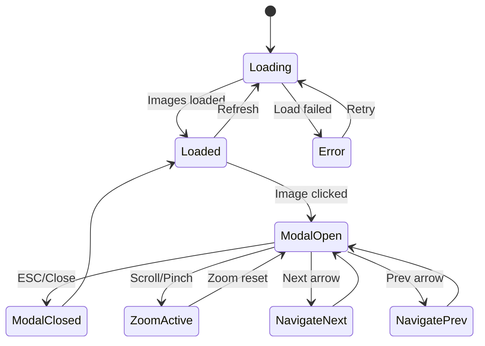
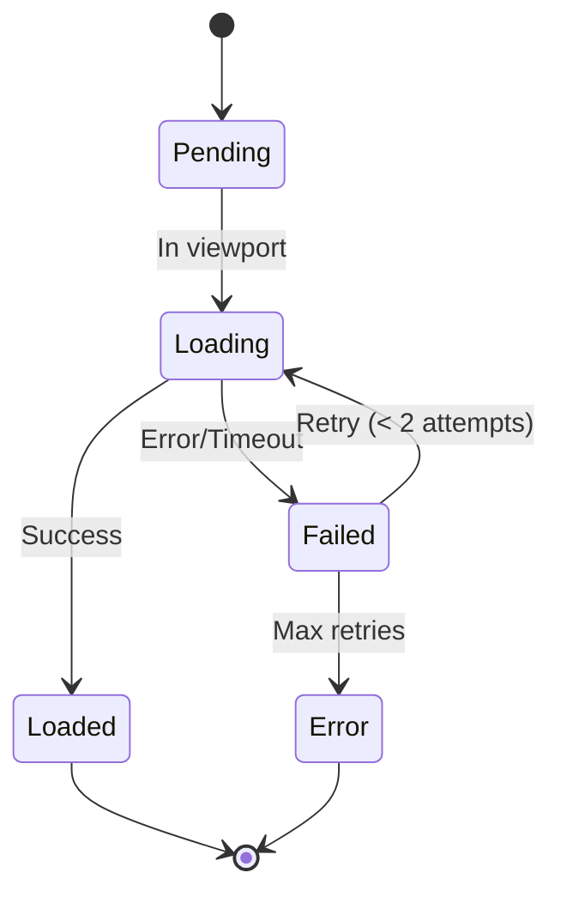

# Data Model: Interactive Visualization & Performance Audit

**Feature**: 011-interactive-visualization  
**Date**: 2025-11-10  
**Status**: Complete

## Frontend Data Models

### ImageItem
Represents a single image in the gallery with associated metadata.

```typescript
interface ImageItem {
  // Core image properties
  url: string;              // WebP format preferred, JPEG fallback
  fallbackUrl?: string;     // JPEG/PNG fallback for older browsers
  thumbnailUrl: string;     // Low-quality placeholder for blur-up
  
  // Content metadata
  caption: string;          // Display caption for the image
  altText: string;          // Accessibility alt text
  
  // Source information
  source: 'upload' | 'ocr'; // Where the image originated
  sourceId: string;         // Reference to upload or extraction record
  
  // Dimensions for optimization
  width: number;
  height: number;
  aspectRatio: number;      // Pre-calculated for layout stability
  
  // Performance metadata
  fileSize: number;         // Bytes
  format: 'webp' | 'jpeg' | 'png';
  
  // Optional metadata
  tags?: string[];          // For categorization
  metadata?: Record<string, any>; // OCR results, EXIF data, etc.
}
```

### GalleryState
Manages the interactive state of the image gallery and modal viewer.

```typescript
interface GalleryState {
  // Modal state
  isOpen: boolean;
  currentIndex: number;
  
  // Loading states
  loading: boolean;
  loadingImages: Set<string>; // URLs currently loading
  
  // Zoom/pan state
  zoomLevel: number;         // 1.0 to 3.0 (300% max)
  panPosition: { x: number; y: number };
  
  // Navigation state
  images: ImageItem[];
  totalCount: number;
  
  // Error state
  error: string | null;
  retryCount: Map<string, number>; // Track retries per image
}
```

### GalleryConfig
Configuration options for the gallery component.

```typescript
interface GalleryConfig {
  // Layout configuration
  columns: {
    mobile: number;          // Default: 1
    tablet: number;          // Default: 2
    desktop: number;         // Default: 3
  };
  
  // Performance settings
  lazyLoad: boolean;
  preloadCount: number;      // Images to preload ahead/behind
  imageTimeout: number;      // milliseconds (default: 10000)
  maxRetries: number;        // Default: 2
  
  // Zoom settings
  maxZoom: number;           // Default: 3.0 (300%)
  zoomStep: number;          // Default: 0.25
  enablePan: boolean;
  
  // Animation settings
  enableAnimations: boolean;
  animationDuration: number; // milliseconds (default: 300)
  
  // Accessibility
  enableKeyboard: boolean;
  enableAria: boolean;
}
```

## Backend Data Extensions

### Enhanced Upload Record
Extends existing upload model to support gallery features.

```python
class UploadRecord:
    # Existing fields...
    id: str
    filename: str
    original_path: str
    
    # New gallery-related fields
    extracted_images: List[ExtractedImage] = []
    gallery_metadata: Dict[str, Any] = {}
    
    def add_extracted_image(self, image_data: Dict) -> ExtractedImage:
        """Add an extracted image to this upload record"""
        pass
    
    def get_gallery_items(self) -> List[Dict]:
        """Get images formatted for frontend gallery"""
        pass

class ExtractedImage:
    """Represents an image extracted from a PDF"""
    
    id: str
    upload_id: str
    filename: str
    path: str                  # /static/images/
    thumbnail_path: str        # Low-quality placeholder
    
    # Image properties
    width: int
    height: int
    format: str                # webp, jpeg, png
    file_size: int
    
    # Content metadata
    page_number: int
    caption: str               # From OCR or LLM
    alt_text: str              # Generated for accessibility
    
    # Processing metadata
    extracted_at: datetime
    ocr_confidence: float
    processing_status: str     # pending, completed, failed
    
    def to_frontend_item(self) -> Dict:
        """Convert to ImageItem format for frontend"""
        pass
```

## API Contracts

### GET /api/images/:upload_id
Retrieve all images for a specific upload in gallery format.

**Request**: 
```http
GET /api/images/12345
```

**Response**:
```json
{
  "success": true,
  "data": {
    "images": [
      {
        "url": "/static/images/extracted_001.webp",
        "fallbackUrl": "/static/images/extracted_001.jpg",
        "thumbnailUrl": "/static/images/thumbs/extracted_001_thumb.jpg",
        "caption": "Master Bedroom with En-suite Bathroom",
        "altText": "Floor plan showing master bedroom layout with en-suite bathroom",
        "source": "ocr",
        "sourceId": "extract_001",
        "width": 1200,
        "height": 800,
        "aspectRatio": 1.5,
        "fileSize": 245760,
        "format": "webp",
        "tags": ["bedroom", "en-suite"],
        "metadata": {
          "page": 1,
          "ocrConfidence": 0.94
        }
      }
    ],
    "totalCount": 12,
    "uploadId": "12345",
    "generatedAt": "2025-11-10T14:30:00Z"
  }
}
```

### GET /api/images/:upload_id/:image_id/metadata
Get detailed metadata for a specific image.

**Request**:
```http
GET /api/images/12345/extract_001/metadata
```

**Response**:
```json
{
  "success": true,
  "data": {
    "image": {
      "id": "extract_001",
      "uploadId": "12345",
      "extractedAt": "2025-11-10T14:25:00Z",
      "ocrResults": {
        "text": "Master Bedroom 15' x 12' with en-suite...",
        "confidence": 0.94,
        "blocks": [...]
      },
      "exif": {},
      "processingHistory": [
        {
          "step": "extraction",
          "status": "completed",
          "duration": 1250
        },
        {
          "step": "ocr",
          "status": "completed", 
          "duration": 890
        }
      ]
    }
  }
}
```

## Validation Rules

### ImageItem Validation
```typescript
const validateImageItem = (item: ImageItem): ValidationResult => {
  const errors: string[] = [];
  
  // Required fields
  if (!item.url) errors.push('URL is required');
  if (!item.thumbnailUrl) errors.push('Thumbnail URL is required');
  if (!item.caption) errors.push('Caption is required');
  if (!item.altText) errors.push('Alt text is required');
  
  // Format validation
  if (!['webp', 'jpeg', 'png'].includes(item.format)) {
    errors.push('Invalid image format');
  }
  
  // Size validation
  if (item.width <= 0 || item.height <= 0) {
    errors.push('Invalid dimensions');
  }
  
  // Aspect ratio validation
  if (item.aspectRatio <= 0) {
    errors.push('Invalid aspect ratio');
  }
  
  return {
    isValid: errors.length === 0,
    errors
  };
};
```

### GalleryState Validation
```typescript
const validateGalleryState = (state: GalleryState): ValidationResult => {
  const errors: string[] = [];
  
  // Index bounds checking
  if (state.currentIndex < 0 || state.currentIndex >= state.images.length) {
    errors.push('Current index out of bounds');
  }
  
  // Zoom level validation
  if (state.zoomLevel < 1.0 || state.zoomLevel > 3.0) {
    errors.push('Zoom level out of range (1.0 - 3.0)');
  }
  
  // Consistency validation
  if (state.totalCount !== state.images.length) {
    errors.push('Total count mismatch');
  }
  
  return {
    isValid: errors.length === 0,
    errors
  };
};
```

## State Transitions

### Gallery Lifecycle


### Image Loading States


## Performance Considerations

### Memory Management
- Limit loaded images to viewport + preload buffer
- Implement image unloading for distant carousel items
- Use WeakMap for temporary image caches
- Cleanup event listeners on component unmount

### Bundle Optimization
- Lazy load gallery components with React.lazy
- Tree-shake unused image zoom features
- Use dynamic imports for heavy dependencies
- Implement code splitting for mobile vs desktop features

### Caching Strategy
- Browser cache for static images (1 year)
- Service worker for offline gallery viewing
- Memory cache for recently viewed images
- Preload critical images for smooth navigation
